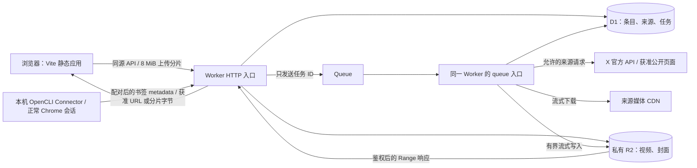

# 05｜架构与数据存储

以下为通过 07 认证 Gate 后的推荐设计，未创建任何云端资源。主要认证入口是已实测的本机 OpenCLI Connector；容量和并发数为初始产品上限，不是 Cloudflare 官方配额。

## 1. 最小架构

Vite 输出静态产物；静态资源可以由 Cloudflare 的静态资源能力交付，业务请求才进入 Worker 处理。[15][34]

推荐一个部署单元同时提供 HTTP 与 queue handler，D1 记录任务真相，R2 保存二进制。不引入独立 API 服务器、Redis、消息中间件集群、向量库或多个下载微服务。

用户鉴权推荐独立于 X 的 Cloudflare Access；所有业务操作从已验证的用户/设备映射得出 `library_id`。本机通过授权的 OpenCLI 会话读取 X，Worker 不接收 Web cookie；设备 API 与用户 API 的认证边界见 07/08。

## 2. 纯 Worker 能做什么

| 环节 | 判断 | 证据及限制 |
| --- | --- | --- |
| Bookmarks 的本机认证采集 | Connector 为主要入口 | 安装版 OpenCLI 1.8.6 已读 120 条并真实分页；普通 JS Worker 不能运行此 Chrome 会话。[81][22] |
| 官方 OAuth 回调/刷新 | 可用 Worker HTTPS/Web Crypto 实现 | 无秘密 contract 17/17 通过；真实 X grant、跨实例刷新及 Access 未验证。[59][60][83] |
| 官方 API JSON / oEmbed | 原理上可直接 fetch | 官方结构与凭据要求见文档；本例 API 匿名 401、oEmbed 200。[8][9][10][56] |
| 本例公开 HTML | 本地运行时实测可解析 | HTML 大小受限，字段结构不是稳定契约；云端出口与许可尚未通过。[56] |
| 直接 MP4 → R2 | 本地运行时实测成功 | 本例 1,729,313 字节，写入与读回摘要一致。[56] |
| 下载中计数和 SHA-256 | 可流式完成 | DigestStream＋FixedLengthStream 组合已实测。[20][21][56] |
| 缩略图保存 | 可直接保存允许的远端图片 | 本例 WebP 字节与读回一致。[56] |
| 播放 Range | R2 支持 ranged get，可自行构造 HTTP 响应 | 本地测试覆盖完整、首段及越界，生产需补齐条件请求和尾段等测试。[17][56] |
| 运行 OpenCLI / 系统 ffmpeg | 不能原样迁入普通 JS Worker | `node:child_process` 是非功能性 stub，Node 兼容不提供操作系统子进程能力。[22] |
| 任意视频抽帧、转码、HLS 合流 | 不纳入纯 Worker MVP | 原生媒体工具需外部进程；WASM 方案尚未验证，不作“绝对不可能”的判断 |

Cloudflare 官方说明 isolate 内存上限为 128 MB，包含 JS heap 和 WebAssembly；网络等待不算 CPU 时间，HTTP 请求可以在连接保持期间运行，而 `waitUntil()` 只提供响应后/断连后的有限延长。[16]

因此，视频大小大于 128 MB 不自动意味着 Worker 不能搬运；关键是有界流式处理，避免 `arrayBuffer()`、`blob()` 或积攒所有分片。反过来，小文件成功也不能证明大文件的 CPU、时间及故障恢复已经合格。[16][19][56]

### 本次与部署前必须区分的限制

| 官方约束 | 对设计的影响 |
| --- | --- |
| Free CPU 10 ms；Paid HTTP 默认 30 秒、可调至 5 分钟。[16] | 推荐 Paid 作为产品试运行基线；解析和哈希要测 CPU，不依赖免费档一定足够 |
| 内存 128 MB / isolate。[16] | 单个上传分片 8 MiB，下载逐块处理，限制并发 |
| Free/Pro zone 的入站 body 通常限 100 MB，Business 200 MB；与 Workers 订阅不是同一个维度。[16] | 大文件分片，每次请求远低于入站限额；不把此值当作 Worker 出站下载大小限制 |
| Paid 子请求默认 10,000 / invocation；Free 为 50，重定向也计数。[16] | 本方案按十余次量级预算，既不逐片大量 fan-out，也不使用旧的固定 1,000 说法 |
| 同时等待响应头的出站连接最多 6 个。[16] | 下载、写 R2 和元数据获取控制并发；及时消费或取消不用的响应体 |
| Queue 消费者 wall time 上限 15 分钟。[29] | 一个任务设计为 10 分钟内终止或交给辅助进程，不靠 HTTP 返回后的后台挂起 |
| R2 单次上传文档标称 5 GiB，最大值有脚注精确限制；multipart 最多 10,000 parts。[18] | 512 MiB 产品限额更小；用户上传采用 multipart，避免接近平台极值 |

Queues limits 页与 Workers pricing 页对 Queue CPU 上限表述存在差异；本设计仅依赖默认 30 秒 CPU 和 15 分钟 wall time，若确需提高 CPU，部署时以实际配置校验及最新限额页为准，不依赖冲突处的较大值。[29][34]

## 3. 最小混合架构

本机 Connector 已有认证实证，作为主要书签采集入口；具体配对、最小权限、心跳、游标与离线协议以 08 为准。不默认部署云端浏览器或 ffmpeg 服务。

### 解析需要浏览器，但文件可匿名读取

用户授权的本机采集自己的书签列表，再为获准任务取得精确媒体描述；Worker 不接收 cookie。示例书签 MP4 的本机 Worker 接力已通过，若真实云端出口也可读取且符合 SSRF、许可与大小检查，Worker 下载入 R2。[81][82]

这个方案不能把“浏览器登录成功”当作抓取或离线复制许可，也不能用于扩大到受保护、付费内容。[12][13]

### 文件依赖会话，或需要媒体工具

同一个本机/容器进程在授权上下文中下载，再调用受限的分片上传接口；ffprobe/ffmpeg 只处理已经获准的媒体，不接收任意用户命令。云端保留 D1、R2 和所有发布判定。

任务进程只拿到具体任务、输入约束、上传目的和有效期，不持有全桶管理凭据；进程退出后删除临时视频和会话文件。若挑战、账号锁定或付费限制阻断访问，任务转为人工处理，不尝试解锁或求解。

## 4. 数据模型

三个概念分别保存：**来源**是 X 帖子，**条目**是用户整理的对象，**blob** 是 R2 中的一份字节。一个帖子可以产生多个视频条目；不同条目可以引用同一个 blob；书签可以没有 blob。

以下是逻辑模型，没有生成迁移或建表代码。

| 实体 | 关键字段 | 约束 / 用途 |
| --- | --- | --- |
| `libraries` | `id, owner_id, quota_bytes, used_bytes, reserved_bytes` | MVP 每人一个库；额度先预留后结算 |
| `connector_devices` | `id, library_id, credential_digest, scopes, status, version, expires_at, last_heartbeat_at, last_auth_success_at` | 无 X cookie；撤销和过期在接收及发布阶段均检查 |
| `connector_batches` | `device_id, batch_id, payload_hash, result_summary, received_at` | 设备＋批次唯一；同 key 不同内容 409，重放返回旧回执 |
| `bookmark_observations` | `library_id, source_id, connection_id, first_seen_at, last_seen_at, sync_run_id, status` | 收藏观察时间不同于帖子发布时间；未完成窗口不推断取消收藏 |
| `provider_connections`（可选 B） | `id, library_id, provider_user_id, scopes, encrypted_grant, key_version, expires_at, refresh_version, lease_until, status` | 仅官方 OAuth；AES-GCM 凭据、账号绑定和刷新租约，不存 Web cookie |
| `items` | `id, library_id, kind, title, note, rating, primary_blob_id?, poster_blob_id?, thumbnail_status, added_at, updated_at, deleted_at?` | kind 为 bookmark/video；主文件与封面可以独立就绪；用户编辑不被重新解析覆盖 |
| `sources` | `id, library_id, platform, post_id, canonical_url, author_handle?, author_name?, text_snapshot?, published_at?, duration_ms_source?, captured_at, last_checked_at?, availability, access_basis, rights_basis` | 同库 `(platform, post_id)` 唯一；来源内容与用户笔记分离 |
| `source_items` | `source_id, media_id, media_index, item_id` | `(source_id, media_id)` 唯一；media_index 仅作展示顺序，不作为长期媒体身份 |
| `source_variants` | `source_id, media_id, variant_id, content_type, bitrate?, width?, height?, observed_at, selected, locator_hash` | 保存变体描述；不长期保存带签名的 fetch URL |
| `blobs` | `id, library_id, r2_key, state, sha256?, size_bytes?, mime, width?, height?, duration_ms_container?, codec_video?, codec_audio?, metadata_trust, created_at, verified_at?` | 随机 key；校验完成后内容不可变；ready blob 同库 `(sha256, size_bytes)` 唯一 |
| `jobs` | `id, library_id, kind, source_id?, item_id?, state, stage, attempt, max_attempts, enqueued_at?, lease_version, lease_until?, next_retry_at?, bytes_done, bytes_total?, error_code?, trace_id, created_at, updated_at` | source import / upload verify / cleanup；只保存可脱敏的错误 |
| `upload_sessions` | `id, library_id, blob_id, r2_upload_id, expected_bytes, part_size, expires_at, state` | R2 multipart ID 属于这个用户和 blob；完成操作只在服务端发生 |
| `upload_parts` | `upload_id, part_number, etag, received_bytes` | 两列联合唯一，支持分片重传和恢复 |
| `tags` / `item_tags` | `library_id, id, name, normalized_name` / `item_id, tag_id` | 标签名称规范化唯一；关联不可跨库 |
| `folders` / `item_folders` | `library_id, id, parent_id?, name` / `item_id, folder_id` | 父子目录不可形成环；条目可在多个文件夹 |

`post_id`、`media_id` 必须保存为字符串；本例 ID 是 19 位十进制数，不能先转 JS Number 再存回字符串。[1][56]

`metadata_trust` 区分 `source_reported`、`client_reported`、`server_probed`。本例分别保存来源时长 7082 ms 与容器时长 7128.526 ms；用户上传时，浏览器提供的尺寸/时长不冒充 ffprobe 已核验数据。[56]

活动任务在解析后立即使用媒体 URL；重试时重新通过允许的来源路径获取，不把可能过期的 URL 长期写入任务队列。持久字段保留 host/path 的摘要和采集时间即可；若后续确需暂存敏感 URL，必须短期加密保存并单独验收。

建议索引：

- `items(library_id, deleted_at, added_at, id)`，用于稳定游标分页。
- `sources(library_id, platform, post_id)` 唯一。
- `source_items(source_id, media_id)` 唯一。
- ready blob 的 `(library_id, sha256, size_bytes)` 唯一约束。
- `jobs(library_id, state, next_retry_at)` 及 `jobs(lease_until)`。
- 标签/文件夹关联分别按两端建立索引。

D1 的 batch 是数据库事务，语句失败会回滚整个 batch；这适合提交条目、引用与配额，但不意味着 R2 和 D1 获得跨服务事务。[49]

## 5. R2 key 与访问策略

| 用途 | key 设计 | 生命周期 |
| --- | --- | --- |
| 主视频 blob | `v1/libraries/{library_id}/blobs/{blob_id}/data.mp4` | 跟随数据库引用，禁止按年龄直接过期 |
| 封面 blob | `v1/libraries/{library_id}/blobs/{poster_blob_id}/data.webp` | 与主视频独立引用及去重 |
| 可选中间产物 | `v1/tmp/{library_id}/{job_id}/{name}` | 仅辅助处理需要时使用，1 天过期 |
| 未完成 multipart | 目标仍是随机正式 key，但对象未发布 | 主动 abort；配置 1 天未完成上传清理作为兜底 |

key 不含作者名、原始文件名、帖子正文或下载签名；扩展名由服务端认可的 MIME 决定。改标题、改分类不会导致 R2 对象搬迁。

在随机正式 key 上完成上传，数据库 blob 暂处 pending；验证后只改变 D1 可见引用，避免“先临时 key，再为哈希命名搬一次完整视频”。失败的 pending 对象由对账任务删除，不能套用永久对象的年龄 TTL。

R2 支持按 prefix 配置生命周期；文档说明生命周期删除通常在到期后 24 小时内发生，默认未完成 multipart 在 7 天后过期，因此不能依赖生命周期实现即时撤回或恰好 24 小时清理。[25]

默认不开启公开 bucket、`r2.dev` 或公开媒体域名；通过应用 Worker 逐次鉴权提供读取。官方文档也将 `r2.dev` 定位为带可变限流的测试入口，不适合作为产品媒体服务承诺。[18]

## 6. 上传与完整性

MVP 所有上传统一使用 multipart；8 MiB 分片，最后一片可较小。R2 对 multipart 的 part 大小及数量有约束，上传实现需按这些约束校验。[48]

浏览器将每片发送给同源 Worker；Worker 检查声明长度、实际读取字节和任务剩余额度，用 FixedLengthStream 将该片交给 `uploadPart`。每次请求上限 8 MiB，不把整个视频放入内存。

选择 Worker 中转的原因是边界直接、没有额外 S3 签名凭据，并能在转发途中强制字节上限。预签名直传是有效的后续优化，但 URL 持有者可在有效期内使用其授权，浏览器跨域还需要 CORS 配置，不能只发 URL 就认为安全约束已经成立。[26][27]

服务端完成 multipart 后，再顺序读 R2 一遍，用 DigestStream 计算完整 SHA-256、检查实际大小与基本文件签名。客户端提供的哈希只可作为提示，不能跳过这一步。完成后的 key 不再授予上传权限；新版本使用新 blob ID。

X 直接下载可在同一上传流上计算 SHA-256；若 Content-Length 不可用，先使用有界 multipart 收集和计数，或按产品上限转为辅助进程，不向未知长度的 R2.put 塞入普通流。[56]

## 7. 去重与并发提交

### 同源去重

规范化后用 `library_id + platform + post_id` 找来源；多媒体再以 `media_id` 定位。来源已存在时复用条目和文件，只补充缺失信息，保留用户标题、笔记和分类。

### 字节去重

上传和下载都以服务端完整 SHA-256＋字节数判断相同文件。同一内容的不同码率、重新编码或不同封装有不同字节，不自动合并；感知相似去重不在 MVP。

一个典型的并发过程：

1. 两个任务各自写随机 key，完成大小和摘要校验。
2. D1 唯一约束选出一个 ready blob；另一任务读到已有 blob 并引用它。
3. 在同一个 D1 提交中更新条目引用、任务完成状态和实际占用配额。
4. 多余 R2 对象进入可重试删除；删除失败时保留对账记录，不假装空间已经释放。

二进制复用不强迫合并用户条目：来自不同来源或带独立笔记的条目可以共用 blob。只在同库去重，避免跨用户通过“文件已存在”推断别人的资料。

## 8. 删除、对账与恢复

- 普通删除先隐藏条目；30 天回收期内保留引用。恢复不触发重新下载。
- 清理时先在 D1 将无有效引用的 blob 标记为 `deleting`，禁止新引用；再删除 R2，最后结算容量，避免去重与 GC 竞争。
- 权利撤回优先撤销读取，再按义务清除关联来源内容；不走 30 天普通回收期。
- 任务中断可能留下 pending 对象、未完成 multipart 或已写入但尚未发布的 blob；定时对账按 job/blob 状态回收。
- D1 条目 ready 但 R2 缺失时，播放返回可理解的不可用结果，并创建恢复任务；不无限代理上游。
- 备份至少包含关系元数据及 blob 清单；产品阶段必须验证恢复后引用和权限仍一致。R2 中有文件并不能替代元数据备份。

平台要求删除的 X 来源即便字节与其他条目重复，也要移除对应来源引用；是否保留其他有独立合法依据的条目应由其来源和许可决定，不能仅凭哈希作权利判断。[12]

## 9. 搜索存储取舍

D1 保存可筛选字段和关系，不用 R2 list 模拟搜索数据库。中文标题/笔记在早期使用参数化包含查询，英文可以使用 FTS5；不把 tokenizer 行为当作语言理解。[30][31]

对中文短词先确保正确结果，再以真实数据测量扫描成本；初始目标为 1 万条、p95 查询在 500 ms 内。达到该规模后，检查 `rows_read`、索引和查询语料，再决定是否启用 trigram 或显式中文分词；该延迟是验收目标，尚无性能实测。

[1]: 11-Sources与证据索引.md#s1
[8]: 11-Sources与证据索引.md#s8
[9]: 11-Sources与证据索引.md#s9
[10]: 11-Sources与证据索引.md#s10
[12]: 11-Sources与证据索引.md#s12
[13]: 11-Sources与证据索引.md#s13
[15]: 11-Sources与证据索引.md#s15
[16]: 11-Sources与证据索引.md#s16
[17]: 11-Sources与证据索引.md#s17
[18]: 11-Sources与证据索引.md#s18
[19]: 11-Sources与证据索引.md#s19
[20]: 11-Sources与证据索引.md#s20
[21]: 11-Sources与证据索引.md#s21
[22]: 11-Sources与证据索引.md#s22
[25]: 11-Sources与证据索引.md#s25
[26]: 11-Sources与证据索引.md#s26
[27]: 11-Sources与证据索引.md#s27
[29]: 11-Sources与证据索引.md#s29
[30]: 11-Sources与证据索引.md#s30
[31]: 11-Sources与证据索引.md#s31
[34]: 11-Sources与证据索引.md#s34
[48]: 11-Sources与证据索引.md#s48
[49]: 11-Sources与证据索引.md#s49
[56]: 11-Sources与证据索引.md#s56
[59]: 11-Sources与证据索引.md#s59
[60]: 11-Sources与证据索引.md#s60
[81]: 11-Sources与证据索引.md#s81
[82]: 11-Sources与证据索引.md#s82
[83]: 11-Sources与证据索引.md#s83
