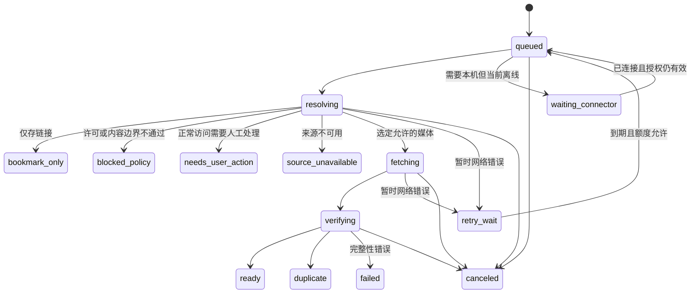

# 06｜Worker API 与导入状态机

本篇定义待实现的接口及一致性约束。02 中的临时 Worker 只验证了少量解析/存储/Range 路径，不是本篇 API 的实现。

主入口是 08 的本机 Connector 书签批次及配对设备接口；本篇保留上传、单链接和媒体任务协议。设备批次有独立的 256 KiB/20 条上限，普通业务 JSON 仍为下述 32 KiB。认证、跨账号绑定和刷新契约以 07 为准。

## 1. API 约定

- 全部业务接口需要应用身份；`library_id` 由服务端会话决定，不从请求 body 信任取得。
- JSON 请求上限建议 32 KiB；上传分片上限 8 MiB；缩略图上限 2 MiB。
- 创建或重试有副作用的任务接受 `Idempotency-Key`，作用域为用户＋路由；同 key 不同有效载荷返回 409。
- 任务创建返回 202 和可查询 ID，不等媒体下载完成；元数据查询和状态轮询返回 200。
- 日志只包含 `trace_id`、任务 ID、阶段、大小、耗时、上游状态和脱敏错误码。
- 外部 URL、正文、文件名均是不可信输入；不执行来源返回的脚本或命令。

### 接口表

| 方法与路径 | 输入 / 结果 | 核心约束 |
| --- | --- | --- |
| `GET /api/me` | 当前库、使用量和可用功能 | 不返回服务端凭据 |
| `POST /api/imports` | `{url, mode: bookmark或copy, rights_basis}` → `{item_id?, job_id}` | 先检查来源格式、许可开关、同源去重和额度 |
| `GET /api/jobs/{id}` | 状态、阶段、字节进度、可执行操作 | 只查当前库；建议前端逐步降至每 5 秒轮询 |
| `POST /api/jobs/{id}/retry` | 新 attempt / 原 job | 只有可重试错误或已解决前置条件允许；不能用来反复试探被禁止内容 |
| `DELETE /api/jobs/{id}` | 取消请求，202/204 | 取消标记可重入；消费者不得晚到发布 |
| `POST /api/uploads` | 文件声明 → upload ID、part_size、预计分片数 | 预留额度；建立随机 R2 key 和 multipart session |
| `GET /api/uploads/{id}` | 已接收 part 编号和状态 | 断点恢复；不暴露其他 upload ID |
| `PUT /api/uploads/{id}/parts/{n}` | 二进制分片 → 接收回执 | 校验编号、实际长度、所属用户和 session 状态 |
| `POST /api/uploads/{id}/complete` | 完成请求 → 校验 job ID | 服务端使用自己的 part 回执；完成后不再允许写该对象 |
| `DELETE /api/uploads/{id}` | abort | 回收 reservation；失败可重试 |
| `GET /api/items` | 游标、查询、筛选、排序 | limit 默认 50、最大 100；稳定排序追加 ID |
| `GET/PATCH/DELETE /api/items/{id}` | 条目详情 / 修改 / 普通删除 | 更新使用版本条件，避免覆盖另一端修改 |
| `POST /api/items/{id}/restore` | 回收站恢复 | 不能恢复权利撤回或彻底删除对象 |
| `POST /api/items/batch` | 最多 100 个 ID 的分类操作 | 全部校验所属库；逐项返回结果 |
| `GET/POST /api/tags`，`PATCH/DELETE /api/tags/{id}` | 标签维护 | 规范化名称唯一，删除只移除标签关系 |
| `GET/POST /api/folders`，`PATCH/DELETE /api/folders/{id}` | 目录维护 | 禁止目录环与跨库父节点 |
| `GET/HEAD /api/media/{blob_id}` | 视频/封面字节与 Range | 先鉴权并检查可见引用，再取 R2 key |

P1 的目录导出、智能文件夹和时间点笔记可以增加接口，不在 MVP 预建空实现。

对用户表达“保存视频”只表明其请求意图，不自动建立版权或平台访问许可；服务端的功能开关、来源权限和证据检查仍须通过。[12][13]

### 错误结构

```json
{
  "error": {
    "code": "UPSTREAM_LOGIN_REQUIRED",
    "message": "来源需要人工处理，已保留链接。",
    "retryable": false
  },
  "trace_id": "诊断关联ID"
}
```

即时参数错误使用 400/422；应用身份缺失 401；权限/策略拒绝 403；幂等冲突 409；超出请求大小 413；配额/频率拒绝 429。异步任务的上游 401/403 等保存为任务结果，查询 job 本身仍是 200，避免误触发应用登出。

## 2. 导入状态机



状态含义：

| 状态 | 进入条件 | 后续动作 |
| --- | --- | --- |
| `queued` | D1 已记录任务与额度预留 | 等待队列投递或补偿分发 |
| `waiting_connector` | 任务需要本机会话且设备离线 | 不算已执行失败、不自动换云端登录；恢复后重验设备/账号绑定 |
| `resolving` | 消费者持有效租约 | 确认许可、读取来源、辨认目标媒体 |
| `bookmark_only` | 用户只存链接或明确降级 | 保留来源与用户整理字段；不声称有文件 |
| `fetching` | 选定 URL 通过安全校验 | 计数、摘要、写 R2，定期更新进度 |
| `verifying` | 源流完成，R2 写入结束 | 核对大小、摘要、类型、去重及当前租约 |
| `ready` | 主文件验证且 D1 发布完成 | 可播放；封面可独立显示 pending/missing |
| `duplicate` | 同源或字节已存在并完成引用 | 复用已有对象，删除本次多余对象 |
| `partial` | 多媒体任务至少一项成功、至少一项失败 | 聚合显示每项结果，只重试失败媒体；图中主链按单媒体表示 |
| `retry_wait` | 可重试且未耗尽预算 | 存 next_retry_at；有界退避 |
| `needs_user_action` | 访问或格式需要正常人工处理 | 用户解决条件后才能主动重试 |
| `blocked_policy` | 付费、保护、DRM、许可不允许或 challenge | 不自动重试；可保留允许的链接 |
| `source_unavailable` | 明确不可用或被移除 | 不无限重试；按来源核验/删除策略处理 |
| `failed` | 完整性失败或重试耗尽 | 保留脱敏诊断、回收对象和预留额度 |
| `canceled` | 用户取消且停止提交 | 中止流、abort multipart、清理无引用文件 |

一个来源任务可串行处理最多 4 个显式媒体项，并在 D1 保存逐项结果；如果超出 MVP 上限则要求用户选择。用户未选的引用帖或外部 card 不自动展开。成功项不因其他项失败重新下载。

## 3. 从 URL 到 R2 的步骤

1. **规范化。**只接受支持的 X/twitter 状态链接，提取十进制字符串 ID，删除不参与身份的查询参数；不同作者路径不能生成同一帖子的新副本。
2. **策略检查。**确认该访问方式和复制方式被允许；无法确定时只做书签，不尝试换端点碰运气。
3. **解析。**优先接收已配对本机 Connector 的规范化书签元数据并重新验证；纯云路线在官方 OAuth Gate 通过后启用。oEmbed 仅做单链接卡片。经许可启用的公开页面适配器使用最多 2 MiB 输入、目标 ID 关联、固定字段白名单和 schema 版本；Worker 不执行来源脚本。
4. **选择变体。**只从目标媒体的 variants 中选择；完整清单可用时在许可与产品大小上限内选一份兼容 MP4。安装版 OpenCLI 只暴露第一个 MP4，需标明实际清晰度，不能假称最高档。[80][82] 没有可信 codec 时保留“来源声明”状态，不能仅凭 `.mp4` 扩展名承诺兼容。
5. **验证远端。**重新检查最终 host、路径及每次重定向；检查 MIME、长度和首段文件签名。HEAD 不支持时可做有界探测，若 Range 被忽略而返回全文件，探测器达到上限就取消。
6. **流式写入。**完整下载要求 200；未经计划的 206、HTML、空体、压缩编码/长度不一致均不能发布为视频。可信长度使用 FixedLengthStream；源流、摘要和 R2 上传都必须等待完成。
7. **完成检查。**检查总字节、完整摘要、任务取消/租约版本；对同库做字节去重。错误路径必须取消相关 stream，不能留下未等待的 Promise。
8. **发布。**D1 事务提交条目与 blob 引用、任务状态及配额；只有这一步之后才允许通过播放 API 读取。
9. **封面。**在独立受限请求中保存来源封面，或接受浏览器生成的封面；封面失败不会推翻已验证的主文件。

Workers 的流式 API、R2.put 和 DigestStream 支持上述数据流；02 已验证本例普通变换流失去长度信息及 FixedLengthStream 修正后的结果。[17][19][20][21][56]

### 长度未知与 HLS

Content-Length 缺失不直接认定文件非法。可以逐块读取，将至多 8 MiB 的当前 part 放入有界缓冲并上传 multipart，累计到 512 MiB 或超过 10 分钟立即停止；这是待实现路径，没有在本次 spike 中证明。

已知大小且单个 MP4 可用时不绕行 HLS。本例确有同时包含音视频的 MP4；HLS 清单展示的是分离的音视频轨道，不能把多个 `.m4s` 字节简单拼接成完整 MP4。[5][6][54][55][56]

如需合流，转交获准的辅助进程；遇到加密、DRM 或访问限制直接停止。MVP 对 X 导入失败采用有界完整重试，不实现源站断点续传；本地上传的 multipart 恢复仍受支持。

## 4. 队列、一致性与崩溃恢复

Queues 提供至少一次投递，消息可能重复，因此任务领取和发布都需要幂等；消息只装 job ID，不携带媒体字节、cookie 或临时签名 URL。[28]

### D1 与 Queue 之间

1. 先在 D1 创建 `queued` 任务、来源/条目占位及容量预留。
2. 再发送 queue 消息；发送成功后更新 `enqueued_at`。
3. 定时分发器重送长时间没有被领取的 queued 任务；“发送成功但更新 enqueued_at 前崩溃”可能产生重复消息，由领取约束消除重复执行。

不新增独立 outbox 服务；`jobs` 本身就是可恢复的待处理清单。队列不可用时返回已接受的任务及等待状态，不假装下载已经开始。

### 任务领取与提交

使用条件更新领取：状态必须可运行，现有租约已过期或为空，同时原子增加 `lease_version`。只有持当前版本的消费者可以写进度、完成和发布。

初始建议：一个 queue batch 1 条、全局并发 2、同库活动下载 1；任务网络/处理总预算 10 分钟，租约稍长于此预算。到期仍运行的旧消费者即使写完 R2，也因租约版本不匹配不能发布。

R2 写入与 D1 提交之间发生崩溃时，对账可以认领经验证对象或删除孤儿；不能仅凭对象存在就把任务设为 ready。D1 事务能保护数据库内更新，但不能回滚已经完成的 R2 写入。[17][49]

容量采用预留制：创建任务时原子检查 `used + reserved + requested <= quota`；成功只结算实际新增的唯一 blob，重复文件释放预留。删除和失败重试的容量变化使用状态条件防止重复扣减。

## 5. 错误与降级矩阵

| 来源结果 | 错误码建议 | 自动行为 | 用户结果 |
| --- | --- | --- | --- |
| 官方 API 匿名 401 | `PROVIDER_CREDENTIAL_REQUIRED` | 不重复匿名请求 | 进入 07 官方授权流程，不索取聊天中的凭据 |
| 官方用户 token 过期/无效 | `PROVIDER_REAUTH_REQUIRED` | 有有效 refresh 才限一次刷新；invalid_grant/撤销即停止 | 用户重新官方授权，不升级 scopes |
| 本机离线 / 会话失效 | `CONNECTOR_OFFLINE` / `LOCAL_REAUTH_REQUIRED` | 等待或人工正常重登，不换云端 cookie | 保留当前资料及上次同步时间 |
| 403 / 登录页面 | `UPSTREAM_ACCESS_DENIED` | 停止；不默认判断为签名过期 | 正常人工处理或保留链接 |
| challenge / CAPTCHA | `UPSTREAM_CHALLENGE` | 停止，不运行求解器 | 保留链接 |
| 明确保护、付费、DRM | `PROTECTED_CONTENT` | 策略阻断 | 不复制文件 |
| 404/410 / 明确删除结果 | `SOURCE_UNAVAILABLE` | 标记来源不可用；按有效通知执行清除 | 展示来源状态，不将重试当恢复保证 |
| 429 | `UPSTREAM_RATE_LIMITED` | 尊重 Retry-After，在预算内退避 | 显示下次尝试时间 |
| 网络超时 / 5xx | `UPSTREAM_TEMPORARY` | 最多 3 次总尝试；建议 1 分钟、5 分钟退避 | 达上限后失败，允许人工再次发起 |
| 明确、可验证的 URL 过期 | `MEDIA_URL_EXPIRED` | 最多重新合法解析一次 | 不将所有 403 当过期反复访问 |
| HTTP 200 HTML / 空 JSON | `NO_MEDIA_FOUND` | 不写成 MP4；不自动换身份或内部接口 | 书签仍可完成 |
| 超过大小或时限 | `LIMIT_EXCEEDED` | 取消流/abort multipart | 说明上限；有条件转辅助进程 |
| R2.put 失败 / 完整性不一致 | `STORAGE_FAILED` / `INTEGRITY_FAILED` | 不发布；清理并在可重试时重试 | 不显示“保存成功” |
| 封面失败 | `THUMBNAIL_FAILED` | 主文件可 ready，封面单独重试 | 通用占位图 |

真实 401、空 syndication、TransformStream 错误及 Range 见 02；本机 Bookmarks 200、folder 404、伪 MP4 与精确 MP4 成功见 07/08；其他分支为待测试设计。[56][81][82]

## 6. 上传协议的细节

服务端计算期望 part 数量和各 part 长度；除最后一片外，必须使用固定 8 MiB，满足 R2 multipart 的大小规则。[48]

每个分片都检查实际读取字节，超出即断开并失败；不只检查 `Content-Length`。回执记录服务端取得的 ETag，完成请求不能任意提供另一上传任务的 part 清单。

完成流程以条件更新将 session 从 `open` 改为 `completing`；新分片此后被拒绝，确认在途分片结束后才能调用 R2 complete。若客户端丢失响应，可以查询状态或幂等重试，不重复创建对象。

完成后的对象只进入 `verifying`，服务器流式重读计算完整摘要；失败则不发布。浏览器预览图、文件名、MIME 和尺寸都是不可信声明，必须分别验证或标注可信度。

本方案暂不发预签名 PutObject URL。若未来采用直传，应防止验证完成后 URL 仍可重用覆盖原对象：使用服务端完成的 multipart 或将临时上传内容复制到不可写的新 key，不能边验证边公开同一个可反复覆盖的 key。[26]

## 7. 播放 HTTP 与 Range

每次读取先校验身份、同库归属、条目可见性、blob ready 状态及权利状态，再访问 R2；不能接受任意 R2 key 或上游 URL 作为播放参数。

R2 get 支持 offset/length/suffix 和 Range headers，返回对象含 size、range、HTTP metadata 与带引号的 `httpEtag`；应用仍须正确构造 200/206/304/416 等 HTTP 响应。[17]

| 请求情况 | 设计响应 |
| --- | --- |
| 普通 GET | 200，完整体，正确 Content-Type/Length/ETag，`Accept-Ranges: bytes` |
| HEAD | 与普通 GET 的元数据一致但无 body；忽略 Range |
| `bytes=a-b`、`bytes=a-` | 边界合法时取对应范围；超出末尾的 end 截到 `size-1`，返回 206 |
| `bytes=-n` | n 为正时取最后 min(n,size) 字节，返回 206 |
| 有效但无法满足的范围 | 416，无媒体体，`Content-Range: bytes */size` |
| 语法错误或不支持的多范围 | MVP 忽略 Range，按完整 200 返回，不拼 multipart/byteranges |
| `If-None-Match` 命中 | GET/HEAD 先返回 304，无 body；不继续处理 Range |
| `If-Range` 匹配强 ETag | 按 Range 返回 206 |
| `If-Range` 不匹配或无法可靠判断日期条件 | 返回完整 200，不能返回对应旧版本的部分内容 |
| 未授权、跨库、已删除 | 401 或不泄露存在性的 404；不触发上游下载 |

Range 的语义及条件请求顺序依据 HTTP 规范；R2 的 `onlyIf` 不支持自动处理 `If-Range`，需要应用明确判断。[17][57]

默认 `Cache-Control: private, no-store`，不把鉴权后响应写入公共缓存；`Content-Disposition` 文件名必须清理换行并正确编码。封面也走同一归属检查。

02/08 已验证源站 HEAD、首段/尾段/越界，以及本地 R2 的完整/首段/越界；产品媒体 API 的 HEAD、If-Range、304、多范围和跨库拒绝仍属于后续验收。[56][82]

## 8. Connector 的可选媒体处理能力

设备配对、领取与回报统一使用 08 的 Connector API，不另建一套 runner 服务。确需获准 HLS 合流或抽帧时，只在同一个本机 Connector 增加限权的媒体处理能力；凭据限定资料库、任务种类、有效期及上传目的，不是全桶 key。

结果最少包含来源 ID、媒体序号、字节数、SHA-256、已完成的上传 ID 和可选 ffprobe 结构化字段；服务器核对实际 R2 文件后才发布。不会接受“runner 说成功”作为唯一验证。

调用下载工具时参数由服务器策略生成，不从网页正文、URL 查询串或用户笔记拼 shell 命令；任务进程不提供任意命令执行接口。cookie 和完整会话只留在获准的本机环境，永不进入本项目 API、Queue、日志或文档。

[5]: 11-Sources与证据索引.md#s5
[6]: 11-Sources与证据索引.md#s6
[12]: 11-Sources与证据索引.md#s12
[13]: 11-Sources与证据索引.md#s13
[17]: 11-Sources与证据索引.md#s17
[19]: 11-Sources与证据索引.md#s19
[20]: 11-Sources与证据索引.md#s20
[21]: 11-Sources与证据索引.md#s21
[26]: 11-Sources与证据索引.md#s26
[28]: 11-Sources与证据索引.md#s28
[48]: 11-Sources与证据索引.md#s48
[49]: 11-Sources与证据索引.md#s49
[54]: 11-Sources与证据索引.md#s54
[55]: 11-Sources与证据索引.md#s55
[56]: 11-Sources与证据索引.md#s56
[57]: 11-Sources与证据索引.md#s57
[80]: 11-Sources与证据索引.md#s80
[81]: 11-Sources与证据索引.md#s81
[82]: 11-Sources与证据索引.md#s82
