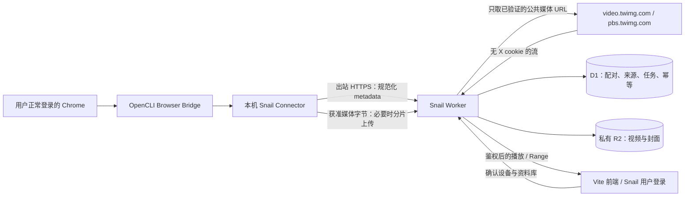

# 08｜OpenCLI 登录桥与开源下载器源码研究

**推荐架构：本机 OpenCLI Connector 负责使用正常 Chrome 会话读取自己的书签；Snail Worker 只接收规范化元数据及获准媒体 URL／字节，再自行校验并流式写私有 R2。**本机认证、两页 Bookmarks 和示例 MP4 已实测；原版 `twitter download` 的成功标记不能作为文件导入成功依据。[81][82]

本篇是研究与接口设计，不包含产品实现。没有修改安装包、Chrome 配置或任何上游仓库；所有临时脚本和原始产物位于 `/tmp/snail-research-iKKC3rYb/`。认证总判断与官方 OAuth 路线见 [07](07-X登录与认证可行性.md)。

## 1. 必须区分“本机运行版本”与“审查的上游 HEAD”

| 对象 | 本次取得的版本证据 |
| --- | --- |
| 实际命令 | `/opt/homebrew/bin/opencli` → `/opt/homebrew/lib/node_modules/@jackwener/opencli/dist/src/main.js`；`--version` 为 **1.8.6**。[82] |
| 安装包声明 | Apache-2.0、Node `>=20.0.0`；npm 1.8.6 元数据的 gitHead 为 `cad35e7a6a5ff3f7d6b859bfa4c45195c0390260`。[79][80] |
| 三份关键源码核对 | 从该固定 gitHead 取得 bookmarks.js、download.js、shared.js，三份均与本机文件逐字节相同。[80][82] |
| 早先独立 clone 的 OpenCLI | HEAD `8271afc67e8504bda94c147f446ee29775d08274`，package 与 release 为较新版本；不是这次命令执行的代码。[37][42][56] |
| Browser Bridge | 真实请求已由当前连接 profile 执行；文档不记录 profile 名、账号名或标识。[81] |

没有执行升级。较新 HEAD 的 bookmarks 有 `--all`、resume/output 文件和更严格的不完整归档处理，而本机 1.8.6 的公开 CLI 只有 limit/top-by-engagement 等选项；不能把新版能力写成本机已具备。[37][80]

| 本机文件 | 字节 | SHA-256 |
| --- | ---: | --- |
| `clis/twitter/bookmarks.js` | 8,280 | `c4a36b64dcf450307f0bc5b39b43986d6087188b3aa5614722b91756531f58c0` |
| `clis/twitter/download.js` | 20,412 | `58ca0d21ff3ef97254c606e1a816f8ac1d6756dcfc02c58a9f8a1837fe22d3d4` |
| `clis/twitter/shared.js` | 24,300 | `3549c7613b06c4ffe60244265ee782d8fb9e289ed79c44e61f5fc0d06e3d1784` |
| `clis/twitter/bookmark-folders.js` | 4,999 | `5d318c1d623b74ba8fb4fb680b4a93578bd604034a7b6c1bd695c106d86ef60e` |
| `dist/src/download/index.js` | 13,944 | `a922793d05824758d85b5de5dbfc6bd10f64167b3f9c9bdb045049f1ee7aa5c6` |

本表为安装源码测量；完整 15 文件摘要保留在临时证据 `opencli-auth/installed-source-manifest.json`。[82]

## 2. 原版单帖下载命令：真实失败，不能包装成成功

实际只读命令为：

```sh
opencli twitter download \
  --tweet-url 'https://x.com/girlofflorence/status/2098577796398567727?s=46' \
  --output /tmp/snail-research-iKKC3rYb/opencli-auth/downloads \
  -f json --trace off --window background
```

本机执行耗时 12.921 秒，exit 0；stdout 2,933 字节、SHA-256 `60c3289d034dbe778e34701b924e63ba9e631af659a9d8bf2ed9ff8b6710c37d`，返回 14 个媒体结果。[82]

| 结果 | 本次观测 | 源码解释 |
| --- | --- | --- |
| 8 张图片 | 文件存在，但没有建立目标帖归属证明，未用于任何产品产物 | 单帖函数扫描整个 document 的媒体图片，没有限定目标 article。[80][82] |
| 3 个 video 失败 | `fetch failed`；URL 类别为 `blob:`，没有网络 HTTP 状态可报 | 浏览器 blob URL 不能由本机 Node 当普通远端视频下载。[80][82] |
| 3 个 video “success” | 均为 **302,239 字节的 HTML**，扩展名 `.mp4`；ffprobe 全部 exit 1 | 本机没有 yt-dlp，`video-tweet` 回退为 HTTP 下载帖子页面；helper 没有按 MIME/ftyp 阻止保存。[80][82] |
| 目标定位 | 三个帖子 URL 中仅一个是给定示例，另两个不是 | DOM 收集了其他 article；之后统一赋上目标 tweet_id，导致字段看似都属于示例。[80][82] |

其中伪 MP4 `tweet_12.mp4` 的 SHA-256 为 `f6527de7438ec16f5b4b3e274c12c67353afbdd65b6b2ad0004ff73d8015f1d0`；另两份分别为 `41d9656073a6908697230776d6535e5e087860262fc76f5d000a47ba2e8557b1`、`7fec2da0accd1e258a456f3366625870a274d001d176977a8fd6ace757f91c78`。[82] 原版 CLI 不暴露每项 HTTP 响应头；源码只有 HTTP 200 才返回该分支成功，但这是源码推断，**不冒充原版命令的网络抓包记录**。[80]

全部 11 个实际落盘文件在类型检查后已删除，未打开查看内容、未进 R2、未进文档。没有再次执行这个会扩大收集范围的高层下载命令；已出现的问题必须成为回归样本。[82]

**最小修正方向是包装接口边界，不改本轮上游：**Connector 不调用原版 DOM 批量收集函数；按明确 post/media ID 取元数据，拒绝 blob、页面 URL 和非目标媒体，验证 MIME/文件签名/实际大小/哈希/解码后才能发布。

## 3. 已通过的替代链路：真实书签 → 精确 MP4 → Worker/R2

从真实 120 条书签结果中只选择给定 post ID；其 `media_urls` 含一条直接 MP4，调用安装包 `httpDownload(url, tempPath, {timeout: 30000, maxRedirects: 0})`，**没有传入 X cookie 或其他认证头**。[82]

独立无登录 curl 的 HTTP 证据如下；没有对其他书签进行媒体下载。[82]

| 请求 | HTTP / MIME | 字节或范围 | SHA-256 |
| --- | --- | --- | --- |
| GET 完整 | 200 / video/mp4 | 505,479 | `6b470b2d84abef778e707056fc4287802f1f81b92f9f4297f2eb7bba2ec67dcd` |
| HEAD | 200 / video/mp4 | 声明 505,479；响应体 0 | 空体，不作为文件摘要 |
| 首段 Range | 206 / video/mp4 | `bytes 0-1023/505479`，1,024 字节 | `ff604edaae0bb121dea4fca852832f6bd22556e72a41ea4cc289ce89e2eefae7` |
| 尾段 Range | 206 / video/mp4 | `bytes 504455-505478/505479`，1,024 字节 | `89030b0bd766c531f1500977cc52959f01762d06425c3a5da6f5f74de31c5f5b` |
| 越界 Range | 416 / video/mp4 | `bytes */505479`，响应体 0 | 空体 |

本表全部为真实请求记录；首尾字节与完整文件切片一致。[82]

ffprobe 确认 320×568、H.264 视频与 AAC 音频；容器时长 7.128526 秒，ffmpeg 完整解码通过。[82] 这是解码验证，未进行浏览器交互播放测试；不能把“可解码”扩大成所有浏览器兼容承诺。

本机 workerd 随后从同一 CDN URL 取流，计数及 SHA-256 后写入 Miniflare 的 R2，读取验证得相同字节数/摘要，完整读回 200、Range 206、越界 416。[82] **没有部署真实 Cloudflare R2，不能将模拟存储写成云端已通过。**

02 中的最高 MP4 档为 1,729,313 字节；两份不同哈希/大小来自不同变体，不是这次下载损坏。[56][82]

## 4. 本机 adapter 实现审查

### 4.1 Browser Bridge 与认证头

实际实现链为 `CLI / adapter → 本机 HTTP daemon → WebSocket → Chrome 扩展 → 页面 evaluate / Chrome cookies API`；daemon 绑定回环地址，Page 将命令发给指定 browser session/target。[80]

| 文件 / 位置 | 已确认机制 |
| --- | --- |
| `clis/twitter/auth.js` | quick check 检查 `auth_token`、`ct0` 字段是否存在；完整身份检查还访问 home 的 profile 链接；只检查字段存在不能证明授权仍有效。[80] |
| `dist/src/browser/bridge.js` / `page.js` | 建立本机 session、复用连接 profile；`getCookies` 向扩展发 cookies 命令，`evaluate` 通过 exec 返回结果；关闭临时 lease 不关闭持久 daemon。[80] |
| `clis/twitter/bookmarks.js:118` 起 | 当前会话提供 CSRF 材料；请求头字段包括 `Authorization`、`X-Csrf-Token`、`X-Twitter-Auth-Type`、`X-Twitter-Active-User`；页面 fetch 使用 `credentials: include`。[80] |
| 同文件 query ID 获取 | 先请求公开 twitter-openapi 的 placeholder 映射，再找页面 client-web JS 的操作定义，最后使用内置 fallback；公开映射不是 X 官方稳定 API。[80] |
| `dist/src/daemon.js` | HTTP/WS 检查 Origin、命令自定义头及请求体上限；接受扩展 origin 或无 Origin 的本机客户端；它不是 Snail 用户/设备授权服务。[80] |

此 Bookmarks 路径没有调用 guest activate；使用的是本机已有用户会话，源码 Web 客户端认证材料也不是用户授权产生的官方 OAuth refresh token。[80] 本篇只报告字段名与用途，不报告任何 cookie、CSRF、Authorization 或会话值。

独立 clone 的固定版本扩展 manifest 含 debugger、cookies、tabs 等权限及 `<all_urls>`；这是通用自动化桥的权限范围，不能当作仅能读取书签的安全隔离。[37] 本机 npm 包未带 extension manifest，本次没有检查 Chrome profile 中实际安装的扩展文件，不能用 clone manifest 冒充其逐字节审计。[82] 本机 daemon 的回环绑定和 Origin 检查也不能防止同机恶意进程滥用；不得将该端口代理到公网。

**默认指纹补丁的处理：**安装版 Page.goto 会调用 generateStealthJs；首次原版 CLI 使用了其默认链，后续观察器新建临时 lease 并以 `waitUntil: 'none'` 导航，未运行该补丁，真实分页照样成功。[80][81] 未来 Connector 应固定这种调用路径，遇到登录墙/challenge 直接停下；不把 stealth、验证码服务或账号池列入架构。

### 4.2 Bookmarks、variant 与 cursor

| 环节 | 1.8.6 的实际实现 | 产品影响 |
| --- | --- | --- |
| 数据入口 | `/i/api/graphql/{queryId}/Bookmarks`；variables 包含 count、可选 cursor，另有 features。[80] | 非官方 Web 接口，schema/query ID 变化是维护风险 |
| 时间线解析 | 兼容 bookmark_timeline_v2 与 bookmark_timeline；读取单项与 module item。[80] | 未来需区分“空书签”与“schema 不认识”，不能都返回空成功 |
| 游标 | 取 Bottom/ShowMore；最多 100 次循环，遇到无游标或相同游标停止。[80] | 本机 CLI 不导出可持久续传 cursor；内部有分页不等于产品有断点恢复 |
| limit | 每页请求 min(100, 剩余数＋10)，最终 slice(0, limit)。[80] | 实测 1→上游 11 条；120→99＋31 条，裁切后 120。[81] |
| 去重 | 单次调用用 post rest_id 的 Set 去重。[80] | 跨次/跨设备去重必须由 Connector/Worker 补充 |
| 媒体 | 优先 extended_entities.media；读取 video_info.variants，选择第一个 video/mp4；没有 MP4 时可退到图片；posters 与 URL 对齐。[80] | 不能凭 has_media 断言是视频，也不能凭第一个 MP4 宣称最高画质 |
| 文件夹 | `/i/api/graphql/{queryId}/bookmarkFoldersSlice`，一次请求，兼容多种返回 envelope。[80] | 本次 404；没有实测到可用文件夹或其完整分页，暂不承诺同步 X 文件夹。[81] |
| 页面下载 | 整页 img/video/videoPlayer 扫描，再统一赋目标 tweet_id。[80] | 已出现范围错误和伪 MP4，禁止直接复用作自动入库。[82] |

较新 clone 的 Bookmarks 增加 resume 文件、输出归档、重复 cursor/缺少 instructions/未穷尽等处理；是否升级需要单独回归。本轮未改安装版本，不以新版代码补写本机已通过的测试。[37][80]

### 4.3 下载 helper 的认证与安全限制

`media-download` 对 video-tweet/video-ytdlp 在存在 yt-dlp 时导出本机临时 Netscape cookie 文件，finally 删除；导出函数以 0600 写文件。[80] `ytdlpDownload` 在缺 cookie 文件时可能回退 `--cookies-from-browser chrome`；这不是无秘密、无配置的运行方式。[80]

`httpDownload` 会把传入的 Cookie 字符串附到初始媒体请求，跨 host 重定向才移除；原版单帖函数把 X cookie 传给整个媒体批次，即使某些 CDN 文件不需要它。[80] 本轮后续精确 MP4 下载显式不提供 cookies，从技术结果看并无必要把 X 会话交给此 CDN 下载步骤。[82]

helper 检查状态 200，却未验证输出 MIME 与文件签名；网络超时计时器在拿到响应后清除，不能据此保证整个 body 读取都有同一超时预算。[80] Worker 的接收路径必须自行执行 06/09 的有界读取、超时、类型、来源及发布检查。

## 5. 开源候选：实际 clone 与 extractor 对照

五个独立只读 clone 的 commit、许可证与维护证据详见 [03](03-上游源码审查与方案评分.md)；至少覆盖通用视频下载器 yt-dlp、素材下载器 gallery-dl，以及专门 X 客户端 Twikit/twitter-api-client。没有在本机账号运行这些工具的 cookie 导出、密码登录或解锁路径。[37][38][39][40][41][56]

| 候选与实际读过的源码 | cookie / GraphQL / guest / syndication | variant / HLS / 部署与许可 |
| --- | --- | --- |
| **yt-dlp**：`yt_dlp/extractor/twitter.py`、`yt_dlp/cookies.py` | Twitter extractor 默认 GraphQL；按 auth_token 区分会话，否则请求 guest activate；可选 syndication 带客户端参数及特定 UA；源码存在 429 转 syndication。cookies 模块会读取浏览器数据库和平台密钥材料，不能把 `--cookies-from-browser` 当无凭据模式。[38] | 从 video_info.variants 区分 MP4 与 m3u8；HLS 格式解析与需要时的 ffmpeg 合流是另一阶段。Python ≥3.10，源码/PyPI 主许可 Unlicense，分发二进制须另看 bundled licenses。普通 JS Worker 不能直接运行 Python/ffmpeg。[38][22] |
| **gallery-dl**：`gallery_dl/extractor/twitter.py`、`gallery_dl/cookies.py` | Bookmarks extractor 调 user_bookmarks GraphQL 并分页；密码登录实现明确不再支持；浏览器 cookie loader 使用 Chromium/Firefox 数据库；guest activate、CSRF 与 client transaction ID 在源码中存在。[39] | 对 variants 取 bitrate 最大值，也可委托 ytdl；不能把不存在 bitrate 的 HLS 当最高 MP4。Python ≥3.8＋requests，GPL-2.0-only；适合批量素材但会增加一套运行时及分发义务。[39] |
| **Twikit（专门 X）**：`twikit/client/client.py`、`client/gql.py`、`media.py` | `get_bookmarks`/folder timeline 使用内部 GraphQL/cursor；save_cookies 用 JSON 明文持久化，load_cookies 再读回；包含可选解锁/验证码路径，本次未运行。[40] | 媒体下载代码读 response.content 后写文件，非有界流式大文件搬运。MIT，Python ≥3.8；HTTPX/lxml/Js2Py 等依赖，不能直接搬入 JS Worker。[40] |
| **twitter-api-client（专门 X）**：`twitter/account.py`、`scraper.py`、`constants.py` | bookmarks 方法绑定内部 GraphQL 操作；会话接受 cookie 字典/文件，save_cookies 写 JSON；不属于官方 OAuth Bookmarks SDK。[41] | 视频 variant/下载实现有参考价值，但已读 download_media 存在 verify=False 与较高并发默认值；MIT，当前 HEAD 较旧，不推荐生产依赖。[41][46] |
| **OpenCLI**：本机 adapter、download helper 及独立 clone | 使用真实 Chrome 会话；对 Bookmarks 已实测成功，文件夹 404；无法把现有 Web 会话转成官方 OAuth scopes。[80][81] | Node＋Chrome＋扩展，Apache-2.0；更适合作为本机登录态采集器。DOM download 的失败和低档 MP4 选择已实证。[79][80][82] |

源码里出现 guest token、syndication 参数或 transaction 生成只说明实现路径，不代表本研究执行或批准这些回退。对于 429/challenge，Snail 的规则是退避/人工处理，**不跟随下载器默认回退来规避限制**。

维护快照：OpenCLI 较新 release 为 2026-08-30，yt-dlp 为 2026-08-19，gallery-dl 为 2026-09-12；Twikit 最新 release 仍为 2025-02-06；twitter-api-client 的 latest release API 404，不能把这理解成仓库不可读取。[42][43][44][45][46] 本机用的是 OpenCLI 1.8.6，不能以较新发布替它担保当前错误已修复。[79][82]

选型结论：已有直接 MP4 时，Worker 原生 fetch/R2 就足够，不为这个案例增加 Python。需要已获准 HLS 合流/容器处理时再引入一个隔离的 yt-dlp＋ffmpeg 本机进程；不同时维护三种抓取库，不运行账号池、自动解锁或代理轮换。

## 6. 推荐的最小混合架构



职责固定为三层：Chrome 持有 X Web 登录态；Connector 只读选定账号书签并把允许的数据投递给自己的 Snail；Worker 控制资料库权限、SSRF、额度、去重及最终媒体发布。本机 daemon 不对公网开放，云端不向它发送任意 JS/shell 命令。

优先走 **URL 接力**：本机元数据证明属于目标 post/media → Worker 重新校验 URL → 无 X cookie 抓取 → R2。若 URL 只能在用户正常会话环境使用，则在该合法上下文下载后走**字节接力**，Worker 只看到受限上传；若涉及 DRM、付费、受保护内容或 challenge 则停止，不用字节接力扩大权限。

本次 URL 接力已在本机 Worker 运行时通过，真实 Cloudflare 出口还未测；不能因本机 curl 200 就保证 Cloudflare IP 同样 200。[82]

## 7. 配对认证、最小权限与撤销（设计）

为避免把 X 会话变成 Snail 云端的全账号凭据，新增的是 **Snail 自己的设备凭据**，不是上传 X cookie。

1. Connector 向 Worker 申请一次配对，收到高熵临时 device code；用户在已登录 Snail 页面核对短显示码、设备名称和目标资料库。配对过期建议 5 分钟，限尝试次数，未批准不能上传。
2. 用户批准后，设备通过持有的高熵 code 换取一次性展示的随机 256-bit 设备凭据；云端只存其 SHA-256 摘要。短显示码不单独兑换凭据。
3. 凭据本机用系统钥匙串保存；只允许 `metadata:ingest`、`jobs:own:read`、`uploads:approved:write`、`heartbeat:write`，绑定一台设备、一个资料库和用户确认的来源账号关系。
4. 设备凭据只发给 Snail 固定 HTTPS origin，不发给 X/CDN。初始建议 30 天到期；正常轮换需旧凭据认证并原子作废旧值，丢失/过期/撤销则重新配对。该时长是产品策略，不是 X 的 cookie 生命周期。
5. Worker 在每次提交和任务最终发布前检查设备状态/version；用户撤销后，旧设备不可领任务、提交 metadata、上传新 part 或发布已完成对象。
6. 用户选择断开时可保留已合法保存的资料或另外删除；Snail 设备撤销与 X 全账号退出是两件事，前者不擅自修改后者。

设备协议本轮只做了秘密摘要、scope、tenant 与重放冲突的 mock；配对 UI、钥匙串、D1 原子兑换和云端验证尚未实现。[83]

通用 OpenCLI 仍有宽权限，所以“限定命令白名单”只是 Connector 防误用的一层。个人试运行建议使用只为本项目授权的 Chrome profile；更严格隔离应使用专用扩展，只在 x.com 的明确用户动作/书签读取场景工作，避免继承 `<all_urls>` 的通用桥权限。[37][80]

### 建议设备 API

| 接口 | 身份 / 限制 |
| --- | --- |
| `POST /api/connector-pairings` | 仅产生短期未授权会话；按 IP 限流，不返回资料库信息 |
| `POST /api/connector-pairings/{id}/approve` | Snail 用户身份＋CSRF；批准指定资料库与权限 |
| `POST /api/connector-pairings/exchange` | 高熵 device code；仅批准后一次兑换，过期/重放失败 |
| `POST /api/connectors/me/heartbeat` | 设备凭据；只回自己的启停/协议版本，不能扩展权限 |
| `POST /api/connectors/me/batches` | 设备凭据＋batch id；最多 20 条、256 KiB 设计上限；Worker 规范化与逐条校验 |
| `GET /api/connectors/me/jobs` | 只领取该设备已批准的元数据/媒体任务；无任意脚本字段 |
| `POST /api/connectors/me/jobs/{id}/upload` | 单任务短期上传会话；复用 06 的 8 MiB part 与大小限制 |
| `POST /api/connectors/me/rotate` | 当前设备凭据＋版本条件；旧凭据立即失效 |
| `DELETE /api/connectors/{id}` | 仅 Snail 用户；撤销并阻止所有晚到发布 |

设备批次使用单独的 256 KiB 上限，不覆盖 06 普通业务 JSON 的 32 KiB；过长正文截断/不导入全文，媒体数据不塞 JSON。

## 8. 游标、增量、去重与离线

### 三种状态分开保存

| 状态 | 保存位置 / 设计字段 |
| --- | --- |
| X 私有分页位置 | 本机加密 checkpoint：account binding、adapter version、扫描 ID、next cursor、最后成功页、是否穷尽；不传 cloud cursor |
| 云端投递回执 | Connector：batch ID、payload hash、acknowledged_at、待重送项；服务器按设备＋batch ID 幂等 |
| 资料库来源 | D1：library_id＋platform＋post_id，media_id/variant 描述、first_seen_at、last_seen_at、bookmark_status、sync_run_id |

本机 1.8.6 的 CLI 输出没有 next cursor/resume 参数；最小 MVP 可以只同步“最近 N 条”，每次从第一页开始重叠读取，并以本机持久 source ID 集合＋D1 唯一约束去重。[80] 若要全历史/崩溃续传，需要窄 wrapper 暴露已观察到的 cursor 与完整性，或在独立回归后选用上游新版；不能声称现在的 `--limit 120` 就完成历史归档。[37][81]

### 轮询算法（设计）

1. 用户主动“同步最近书签”，或明确开启本机在线时的低频轮询；初始建议 15 分钟一次，不按官方 API 的限额估算 Web GraphQL 容量。
2. 始终从最新页开始，按返回的收藏顺序处理；用 **post ID 去重，不用 post ID 大小或帖子 created_at 作为收藏增量时间**，否则今天收藏旧帖会遗漏。
3. 只有遇到足够重叠的已知连续条目且没有分页错误才停止本轮增量窗口；到预算上限则标 `partial`。对快速新增/重排采用周期性更深窗口对账，不承诺靠单一 watermark 获得严格事件流。
4. 每页先持久化本机 pending，再提交云端批次，拿到 ack 才推进投递 checkpoint；进程崩溃允许重复提交，不允许静默跳过一页。
5. Worker 对同源约束、媒体约束及最终 SHA-256＋字节数去重；同 batch 相同 payload 返回原回执，不同 payload 返回 409。URL 查询参数变化不应生成新的 post/source。
6. 取消收藏不是自动删除文件授权；条目不在最近窗口也不证明取消收藏。只有范围完整的对账或明确用户操作才能更新其收藏关系；平台/版权删除义务另行处理。

实际已确认两页 cursor 工作、输出数量和跨调用前缀一致；还没有观察真实新增/取消收藏事件，也没有扫描完历史。[81] 计划中的新增测试由用户以后手工在 X 操作自己的测试帖，本轮保持只读。

### 心跳与离线

- 设计每 60 秒轻量心跳，三次未见则 UI 显示“本机离线”；这不是 X 认证有效的证明，只有受控 Bookmarks 读取才能更新 `last_auth_success_at`。
- 本机关机、Chrome 关闭、扩展断开时任务等待，不增加云端 cookie 登录回退；已有 R2 文件仍按 Snail 权限播放。
- 本机待发送队列设置 100 MiB/7 天设计上限，满时暂停采集并提醒；重连先检查设备撤销/账号绑定，再发送积压。
- 游标被拒绝时从最新页做有限重叠扫描并标记旧 backfill 未完成；403/challenge/登录失效转 `needs_user_auth`，429 按来源可用的等待信息退避，不换账号/代理/端点规避。
- 账号切换必须使旧连接失效或进入人工确认，不能让同一 Snail 设备悄悄同步另一个 X 账号；本次没有切换用户账号测试。

## 9. 规范化协议与审计

每个批次只允许设计字段：`schema_version, batch_id, device_id, sync_run_id, observed_at, posts[]`；每帖包含 `post_id, canonical_url, text_excerpt?, author?, media[]`，每媒体含 `source_media_id?, type, variants?, preview_url?, width?, height?, duration_ms?, metadata_quality`。

Worker 从已验证设备记录决定 library ID，不接受载荷覆盖；把 URL 视为不可信输入，即使来自真实浏览器。只接受允许的 X post URL 与已审核 CDN、HTTPS/443、逐跳校验；禁止 blob/data/file、内网 IP、任意嵌套 URL、任意输出路径和任意请求头。

协议明确禁止 `cookies, cookie_file, authorization, headers, password, token, browser_profile, raw_html, raw_response` 等字段；未知字段拒收。正文或 URL 中的可疑凭据也不进入日志；私有 signed URL 如确需暂存，按任务短期加密，不能塞进 Queue 或公开诊断。

“metadata ingest 已接受”和“允许下载媒体”分开：默认来源入收件箱；只有权利依据与访问方式明确的媒体才生成有大小/有效期/目标限制的任务，Connector 凭据本身不能批准任意远端 URL 下载。

审计只保留时间、匿名 device/connection ID、command kind、版本摘要、页数、HTTP 状态、字节数、任务状态、结果计数及摘要；不留账号名、私人书签正文、cursor、cookie、认证头值或临时文件路径中的身份信息。原始 Browser Bridge trace 默认关闭。

## 10. 可复查证据与验收

| 临时文件 | 内容 / 复查方式 |
| --- | --- |
| `opencli-auth/run_readonly.py` | 原版下载与 limit 3 的命令包装，stdout/stderr 定向临时目录，只输出白名单统计 |
| `opencli-auth/adapter-observer.mjs` | 调用安装 adapter，观测真实 Bookmarks/folder HTTP；不注入 stealth，不打印凭据/书签内容 |
| `opencli-auth/adapter-observer-results.json` | 120 条、两页、cursor 布尔标志、目标命中、文件夹 404 的脱敏结果 |
| `opencli-auth/artifacts.json` | 伪 MP4 的类型、大小、哈希、ffprobe exit；对应媒体已删除 |
| `opencli-auth/direct-approved.mjs` | 精确示例 MP4 的底层 OpenCLI 下载；没有 cookies 参数 |
| `opencli-auth/media-validation.json` | MIME、完整解码、首尾切片与 curl/OpenCLI 摘要相等 |
| `opencli-auth/worker-authenticated-media-results.json` | 无 X cookie 的真实 fetch→本地 R2→读回/Range |
| `opencli-auth/mock-contract-results.json` | 17 个无秘密认证/幂等契约检查；不是实际 OAuth grant |

证据根目录为 `/tmp/snail-research-iKKC3rYb/`；原始私人响应、媒体文件、cookie 临时文件及模拟 R2 对象不作为交付物，清理记录见 Sources。不能要求用户分享该临时目录或原始诊断包。

进入产品开发前，07 的 G1–G5 必须按范围通过；尤其不能用 `exit 0`、`status=success` 或 `.mp4` 扩展名判定成功。本轮已经得到可用本机登录态的实证，下一阶段应验证这个**受限 Connector**，而不是投入整套 UI 后再发现身份链路不稳定。

[22]: 11-Sources与证据索引.md#s22
[37]: 11-Sources与证据索引.md#s37
[38]: 11-Sources与证据索引.md#s38
[39]: 11-Sources与证据索引.md#s39
[40]: 11-Sources与证据索引.md#s40
[41]: 11-Sources与证据索引.md#s41
[42]: 11-Sources与证据索引.md#s42
[43]: 11-Sources与证据索引.md#s43
[44]: 11-Sources与证据索引.md#s44
[45]: 11-Sources与证据索引.md#s45
[46]: 11-Sources与证据索引.md#s46
[56]: 11-Sources与证据索引.md#s56
[79]: 11-Sources与证据索引.md#s79
[80]: 11-Sources与证据索引.md#s80
[81]: 11-Sources与证据索引.md#s81
[82]: 11-Sources与证据索引.md#s82
[83]: 11-Sources与证据索引.md#s83
