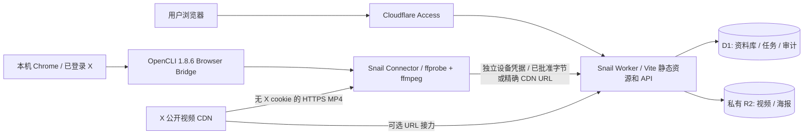

# 12 · 实施架构与认证边界

本文件记录 0.1.0 的实际实现，研究基线 docs/01–11 不回写。认证结论按路径分别成立：本机已登录的 OpenCLI/Browser Bridge 可读取书签并解析目标 MP4；Snail 采用这一 Connector 路径。官方 OAuth/纯云端 X 书签同步不属于本版已实现能力，不能用 Snail 的 Access 登录成功替代 X 授权成功。

## 架构与范围

单 Worker 先鉴权再返回 assets 或 API。浏览器采用 Access 的真实 RS256 JWT；校验 issuer、该站独立 audience、exp/iat/sub/email 与 `type=app`。仅邮箱头、伪 JWT、其他应用 AUD、设备 Bearer 均不能成为网页身份。资料库 ID 为 issuer 与 subject 的 SHA-256；数据库查询绑定这一 ID，不接受客户端选库。

实现包括视频网格、瀑布、列表、影院，响应式播放器，标题/笔记/元数据/海报，收藏、分类、标签、搜索、排序、分页和批量整理/删除。搜索覆盖标题、笔记、标签；默认 48 项一页，最多 100，排序使用稳定 ID 作为次键。分类允许上级关系，但 0.1.0 选择当前分类时不递归包含子分类。没有 OCR、语义检索、自动转码、协作共享或公共媒体链接。

## 认证 Gate 的实际分层

| 路径 | 0.1.0 决定 | 证据和边界 |
|---|---|---|
| A · Snail 自身登录 | CONDITIONAL GO：Access 已部署，等待真实首次 SSO 验收 | 匿名拦截已验证，已登录结果单独记录于发布验收，不把本地测试 JWT 当生产登录 |
| B · X 官方 OAuth | 未实现，保持独立评估 | 仍需开发者应用、scopes、套餐/Bookmarks 权限和用户授权；研究见 07，不能声称有云端 Bookmarks 事件或下载授权 |
| C · 本机 X 会话 | GO：采用 OpenCLI Connector | 真实目标书签读取、精确 MP4、长度/哈希/解码已验证；生产设备配对和入库证据见发布验收 |
| D · 无登录公开页 | 不作为可靠书签同步方案 | 没有“我的书签”身份；只能作为获准单链接能力的上游补充，失败显式保留任务 |

X 可直接下载的表示不等于上传者原始母版，更不证明版权许可。[1] 本版保存实际选取的公开 MP4 变体，并保留来源和媒体 ID；不声称恢复原始上传质量。

## 网页 API

所有用户写请求需要当前 Access JWT、同源 `Origin` 与 `X-Snail-Request: 1`；设备路由使用另外一套鉴权。未知 JSON 字段、嵌套凭据字段和不合 schema 的输入返回 400。

| 路径 | 方法 / 用途 |
|---|---|
| `/api/live` | 公开 GET/HEAD；查询 D1、R2 后输出 status/version，失败 503，no-store |
| `/api/me` | GET 当前已验证身份 |
| `/api/assets` | GET：q、favorite、category、tag、sort、page、limit |
| `/api/assets/:id` | GET/PATCH/DELETE：详情、修改、删除 |
| `/api/assets/bulk` | POST：favorite/unfavorite/category/tags/delete，最多 100 项 |
| `/api/assets/:id/media` | GET/HEAD；R2 流式读取，支持单段和后缀 Range；非法范围 416 |
| `/api/assets/:id/poster` | GET/HEAD/PUT；海报校验后保存 |
| `/api/categories`、`/api/tags` | GET/POST；`:id` PATCH/DELETE |
| `/api/uploads` | POST：建立或恢复分片上传，命中内容哈希则复用 |
| `/api/uploads/:id` | GET 上传状态/已有片；DELETE 取消 |
| `/api/uploads/:id/parts/:n` | PUT 原始分片字节 |
| `/api/uploads/:id/complete` | POST 幂等完成，可能 202，ready 才可见 |
| `/api/jobs` | GET/POST 获准的 X 链接任务；`:id/retry`、`:id/cancel` POST |
| `/api/me/connector-pairings` | GET `code` 查看待批准设备 |
| `/api/me/connector-pairings/approve` | POST 用户批准权限子集 |
| `/api/devices`、`/api/devices/:id` | GET 列表；DELETE 即时撤销 |

错误统一为 `{ "error": { "code": "固定机器码" } }`，不回传原始解析异常、上游响应正文、cookie/header/token。网页将常见错误映射为中文并保留重试入口。

## 安全决定

- Worker 始终位于静态资源之前；workers.dev 与 preview URL 关闭。health 的 Access 例外配置为 `api/live`，实测会覆盖后代路径；Worker 最终只公开精确 GET/HEAD `/api/live`，`/api/live/` 返回 401，用户批准与资料库 API 仍受保护。
- MIME 不是唯一依据：分片一验证文件签名，完成后服务端流式重算完整 SHA-256/大小。Connector 还先 ffprobe，再 ffmpeg 全视频/音频解码。上传本身不在 Worker 中转码，不保证每一种 MOV/WebM 编码能由所有浏览器播放。
- 每片 8 MiB，视频最多 512 MiB，海报最多 2 MiB；每库 50 GiB，上传和 URL 接力共享 5 个活跃任务的额度。额度在插入预留时由 D1 条件语句约束。
- 上游只允许固定 HTTPS/443 `video.twimg.com` 与 `pbs.twimg.com`，媒体 ID 必须属于目标 URL 路径；不接受 IP、用户名密码、片段、未知 query 参数、blob/data/file 或任意转向。每次重定向重验，最多 2 次，完全不转发 X cookie/Authorization。
- 固定 Cloudflare DNS HTTPS 查询检查 A/AAAA 公共地址；它是固定 CDN 的预检，不是通用 DNS pinning。实际连接仍依赖可信 TLS、固定 CDN 和用户配置的网络代理；不开放任意 URL 功能。
- URL 获取 120 秒超时覆盖 body 流，Content-Length 必须存在并在上限内，R2 FixedLengthStream 拒绝过长/不足字节。公开 DNS 检查另有 10 秒上限。Worker 不接受 `redirect:error`，因此用 manual 并拒绝不成功状态。
- 上传/接力 publish 在 D1 batch 内再次校验设备未撤销、有效期、job lease、来源与活动传输状态。取消/撤销/失效租约可留下待清理对象，但不能成为可见资源。
- 页面 CSP、nosniff、frame-ancestors、no-referrer、HSTS 与同源请求检查由 Worker 设置。审计仅存动作、内部 ID、时间；不存输入正文或会话秘密。

## 实现索引与 Sources

代码以 `worker/{auth,index,http,contracts,uploads,relay,devices,jobs,cleanup,library}.ts`、`connector/`、`src/` 为准；回归位于 `tests/unit`、`tests/http`、`tests/e2e`。研究差异不是把原文改写成部署事实；以 GOAL 和发布验收记录更新实际状态。

[1] X Developer Agreement and Policy：https://developer.x.com/en/developer-terms/agreement-and-policy 。可访问性、API 使用许可和作品版权分别评估，具体权利由使用者确认；研究 Sources 详见 11。
